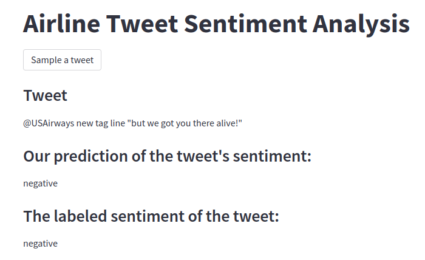

# Airline Tweet Sentiment-Analysis

Project to demostrate ML capabilities to make predictions on text sentiment. Specifically, I compare three models and discuss a little about them. Also, I've built a quick app to visualize in an interactive way the results of the model.

There is only one [notebook](notebooks/main.ipynb) containing all of the analysis and model.

The streamlit app can be found inside the [streamlit_app](streamlit_app/main.py) folder.



## Data

The data was retrieved from [Kaagle](https://www.kaggle.com/datasets/crowdflower/twitter-airline-sentiment). It consists of detailed tweets from a specific period, from certain airlines in the USA.

## Modelling

Three models were tested:

* SVM with TF-IDF matrix.

The reason for using SVM mixed with TF-IDF matrix is that it is a classical model in the literature. Is nice to have a baseline from which you can build. It is fast and intuitive. TF-IDF filters the ordinary and highlights keywords, and then SVM learns how to create (in our case) linear decision from each "word score"
generated by TF-IDF.

* SVM with BERT Embeddings

This approach is more sophisticated by the main idea is to perform sentence embedding using a BERT-based Transformer (miniLM) and from those embeddings train an SVM.

* BERT Embeddings with Neural Networks Classifier (Transfer Learning)

The main difference from before is that with SVM we must use one-vs-one or one-vs.rest meta-learning approaches. What would happen if we could basically just use a single linear layer? But in this case we would use a Neural Network and Stochastic-Gradient-Descent approaches to find the optimal linear weights.

We found oud that the best model from those three was **SVM with Bert Embeddings (miniLM)**.

## Future Works

In relation to model performance:

* Train a more sophisticated Neural Network such as a Convolution Neural Network, or a Recurrente Neural Network, or even Transformer architecures.

* I could perform hyper-parameter optimization for the SVM approaches and for the Neural Networks too.

In relation to data vizualization and exploration:

* I could build model explanability to inform us of the key phrases or words that made the model decide for each sentiment.

## Replicating or Installation

To replicate the results, first download the repository via Git. Then, if you do not have it, please install [Poetry](https://python-poetry.org/) for packaging and dependencies installation, afterwards just run:

```{bash}
poetry install
```

For the notebook, that's it. It would be ready to replicate. For the streamlit app, first run the notebook to generate the results and then, just run:

```{bash}
streamlit run streamlit_app/main.py
```

## References

* [MiniLM: Deep Self-Attention Distillation for Task-Agnostic Compression of Pre-Trained Transformers](https://arxiv.org/abs/2002.10957) (Wenhui Wang, Furu Wei, Li Dong, Hangbo Bao, Nan Yang, Ming Zhou)
* [Sentence-BERT: Sentence Embeddings using Siamese BERT-Networks](https://github.com/UKPLab/sentence-transformers)
* [Boser, B., Guyon, I., Vapnik, V.: A training algorithm for optimal margin classifiers. In: Proceedings of the Fifth Annual Workshop on Computational Learning Theory, Pittsburgh (1992)](https://link.springer.com/referenceworkentry/10.1007/978-0-387-30162-4_415)
* [Scikit-Learn's SVM](https://scikit-learn.org/stable/modules/generated/sklearn.svm.LinearSVC.html)
